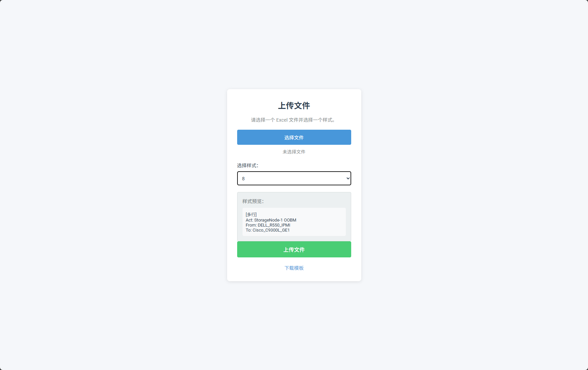

# Cable Label Formatting Tool

<p align="left">🇬🇧 English |  <a title="Chinese" href="README.md">🇨🇳 中文简体</a>
  
<a href="https://www.gnu.org/licenses/gpl-3.0.html#license-text"></a>
<a href="https://github.com/hz157/cable-label"></a> 
</p>


A specialized cable label formatting tool designed for network engineering projects, helping teams achieve standardized and unified cable label management. Ideal for cable identification and labeling in environments such as computer rooms and data centers.

<p align="center"></p>

## ✨ Key Features
- 📊 Excel Data Batch Processing-Supports batch import and processing of cable data in Excel format
- 🏷️ Multiple Standard Label Formats-Offers 9 standard label format options
- 🔄 Automatic Bidirectional Label Generation-Automatically generates bidirectional identification labels (Local end ↔ Remote end)
- 💾 Result Export-Processing results can be exported to Excel format for easy printing and use

## 🌐 Online Usage

Experience now: https://cable-label.bytesycn.cn 
> 💡 Access Note: This service is primarily available within China. If you are located outside of China, you may experience access issues. We recommend using the local deployment option.

No software installation required. Simply upload your Excel file to quickly generate standardized cable labels.

## 🖼️ Style Demo

``` bash
# Style 8
Act: StorageNode-1 OOBM
From: DELL_R550_IPMI
To: Cisco_C9300L_GE1

# Style 9
用途: 存储节点-1 带外管理
本端: 戴尔_R550_IPMI
对端: 思科_C9300L_GE1
```


## 💻 Local Deployment Guide

If you're concerned about data security or need offline usage, you can easily deploy locally:

### Environment Requirements
- Python 3.7+
- pip package management tool

### Deployment Steps

``` bash
# Create virtual environment
python -m venv venv

# Activate virtual environment
# Windows:
venv\Scripts\activate
# Linux/Mac:
source venv/bin/activate

# Install dependencies
pip install -r requirements.txt

# Install dependencies (if in China, use Tsinghua University mirror for faster installation)
pip install -r requirements.txt -i https://pypi.tuna.tsinghua.edu.cn/simple

# Start application
python app.py
```

After starting, access http://localhost:5000 to use the local version.

## 📖 Usage Instructions
- Prepare Data-Format your Excel file according to the template, containing "Name", "From", and "To" columns
- Select Style-Choose from 9 standardized label formats
- Upload & Process-Upload your file and generate standardized labels
- Download Results-Obtain the formatted Excel file

## 🏢 Application Scenarios
- 🖥️ Data Center Cable Management-Cable identification and management in large data centers
- 📡 Network Room Cable Identification-Standardized cable labeling in enterprise network rooms
- 🔌 Structured Cabling Systems-Label creation for office building cabling systems
- 🏢 Enterprise IT Infrastructure-Cable maintenance and management in enterprise IT equipment rooms

## ✅ Advantages
- 🚀 Efficiency Improvement-Significantly enhances cable label creation efficiency
- ✅ Error Reduction-Automated processing reduces human labeling errors
- 🎯 Standardization-Ensures teams use uniform label standards
- 📦 Batch Processing-Supports batch processing of large volumes of cable data
